### 为了方便自定义打包工具，本人开发了一个基于Wix3与WPF的免费自定义打包工具，支持以下功能。有问题可加QQ群交流：658794308，欢迎大家参与开发！
- 支持msi与exe两种安装包格式
- 支持自定UI界面操作
- 支持自定义功能(包括运行脚本，解压文件等等)
- 支持命令行打包(集成到CI/CD)
- 支持混淆obfucar
- 支持日志
- 支持Patch、依赖预置、扩展功能(Windows服务自启动/注册表写入/环境变量等)
- 支持卸载时卸载依赖
- 支持3中主题风格
- 支持非管理员安装(安装系统盘亦可)
- 支持win7 win10 winserver2012

### 待新增功能
1. 每次安装时自动覆盖上次的安装 
2. 卸载程序
3. 回滚
4. 功能可选安装
5. 安装完成后支持脚本嵌入
6. 卸载检测应用是否关闭

### 已知Bug
1. Debug模式下build时CookPopularInstaller.Generate.exe生成日志没看见错误信息，但是显示错误

### 注意
1. 命令行工具为CookPopularInstaller.Generate.CommandLine.exe，接受的配置文件名称自定义，格式必须按照提供的默认package.json配置
2. 依赖项安装包为压缩包时，压缩文件格式必须为.zip(暂时)

### 1.原生Msi安装包
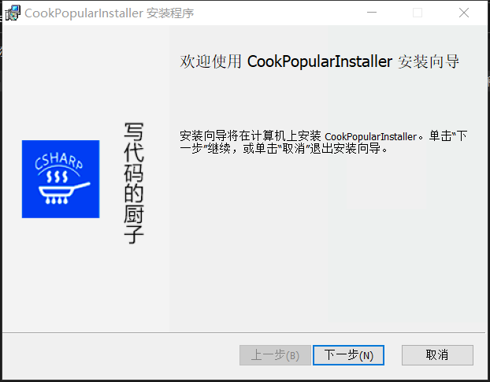
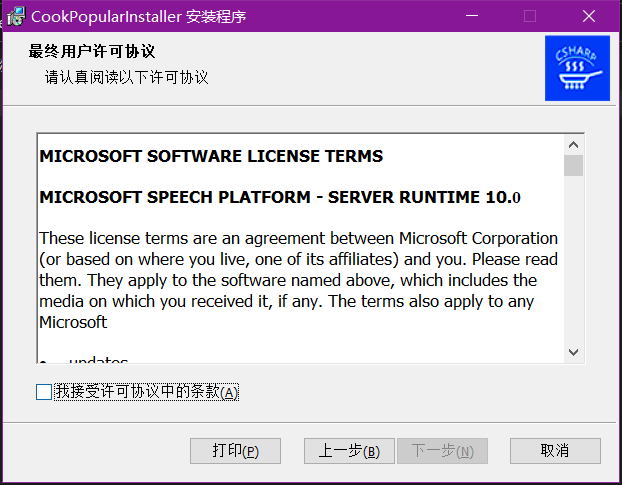
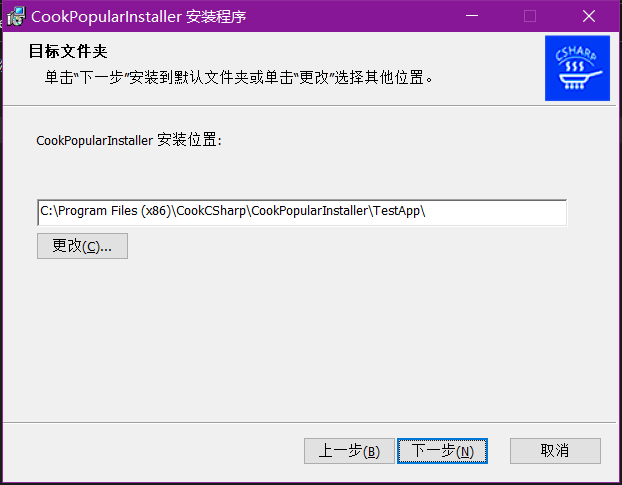
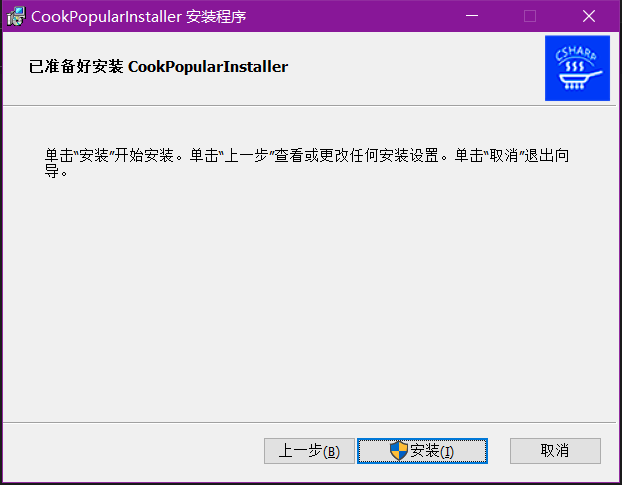
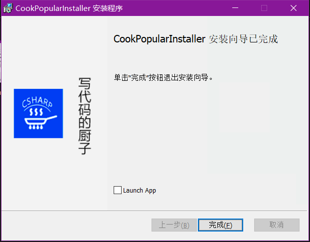

### 2.原生Exe安装包
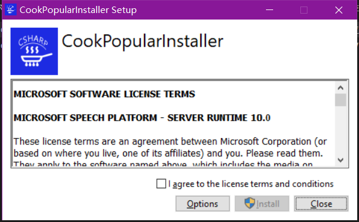
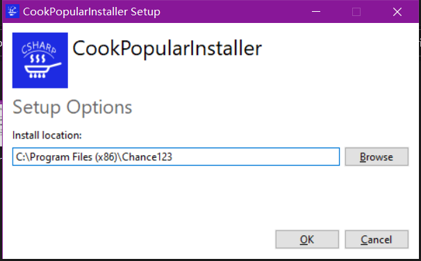

### 3.自定义Exe安装包
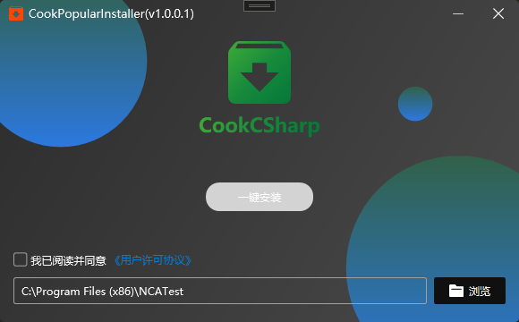

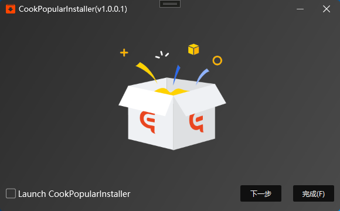
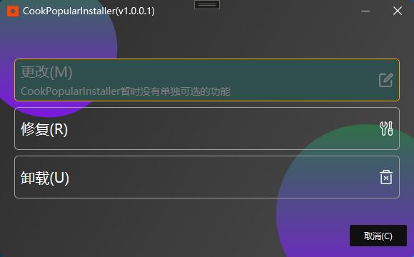

### 4.界面化工具
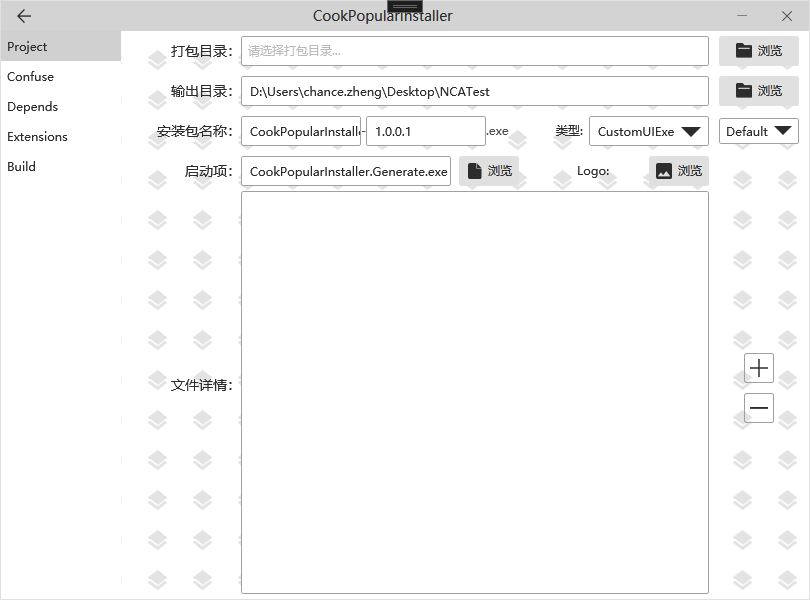
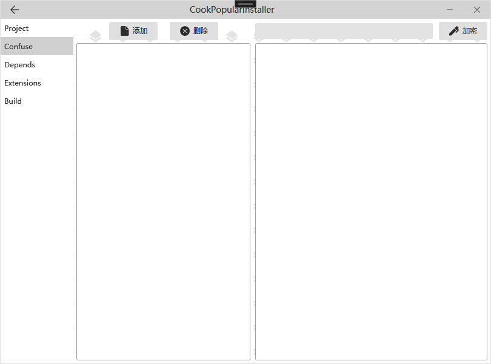
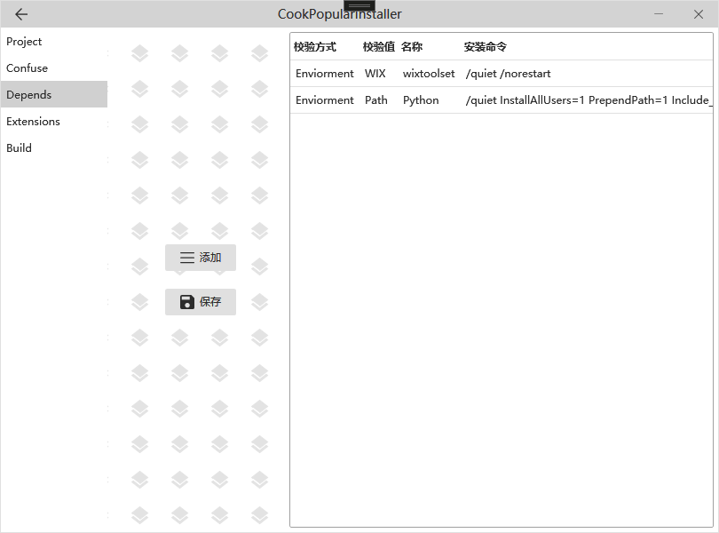
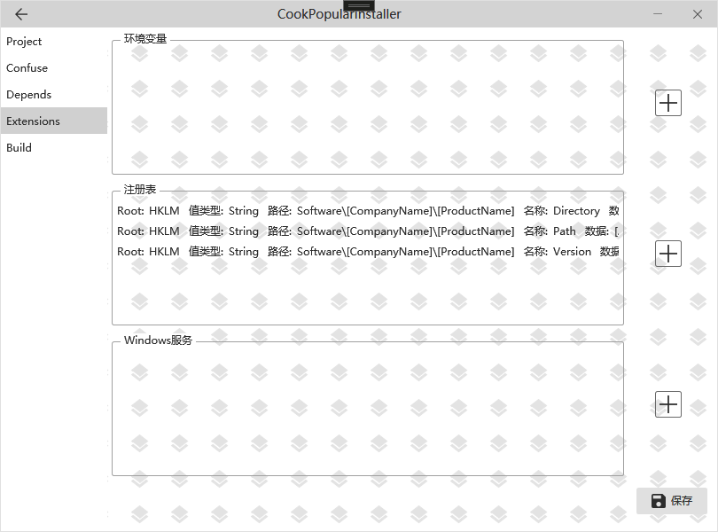
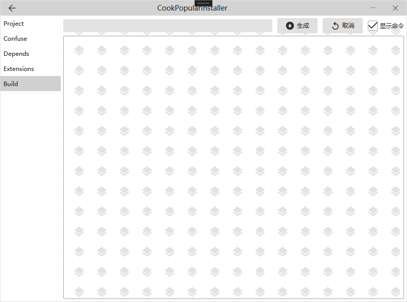

### 5.命令行工具
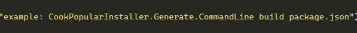