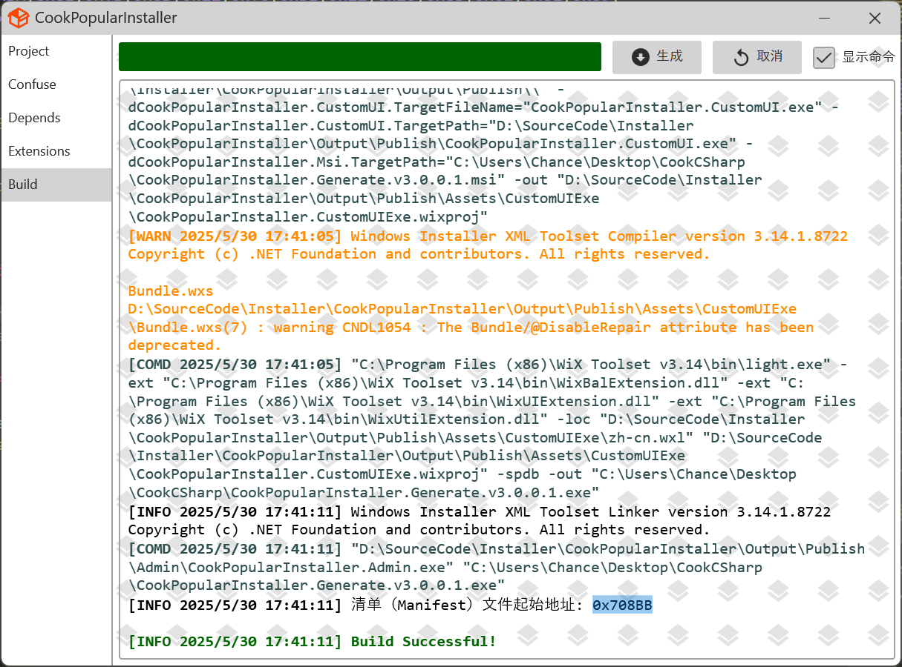

# 基于Wix3的自定义打包工具，支持以下功能

- 支持Msi与Exe两种安装包格式
- 支持自定UI界面操作
- 支持命令行打包(集成到CI/CD)
- 支持命令行安装/卸载
- 支持obfuscar混淆obfuscar
- 支持日志
- 支持更新、回滚、Patch、依赖预置、扩展功能(Windows服务自启动/注册表写入/环境变量等)
- 支持安装前后脚本的运行(bat/vbs/ps1)
- 支持三种主题
- 支持用户协议文件配置
- 支持非管理员安装(安装系统盘亦可)
- 支持win7+系统
- 支持x86/x64两种架构安装包
- 支持多种压缩文件的解压缩(7zip,xz,zip,tar,lzip,bzip2,gzip,rar)
- 支持卸载后清除整个安装目录(亦可配置不清除全部)
- 支持更新/升级(即覆盖安装)和Uninst.exe卸载
- 支持调试
- 支持国际化配置
- 支持Passive模式(简洁UI模式)
- 支持修复功能覆盖或不覆盖原文件

## 安装依赖与使用

1. 安装[wix314.exe](Assets/Depends/wix314.exe)
2. 安装[WiX v3 - Visual Studio 2022 Extension.vsix](Assets/Depends/WiX%20v3%20-%20Visual%20Studio%202022%20Extension.vsix)
3. 安装[python-3.11.1-amd64](Assets/Depends/python-3.11.1-amd64.exe)
4. 运行 python build.py 生成所有项目

## 项目结构

1. [CookPopularInstaller.Msi](CookPopularInstaller.Msi)

    - 基于Wix3的原生Msi格式安装包，win11上需要使用管理员运行，win10不需要，暂不清楚原因

    

2. [CookPopularInstaller.Exe](CookPopularInstaller.Exe)

    - 基于Wix3的原生Exe格式安装包

    

3. [CookPopularInstaller.CustomUI.Exe](CookPopularInstaller.CustomUI.Exe)

    - 基于Wix3的自定义UI格式安装包，支持自定义UI界面，支持命令行打包

   

4. [CookPopularInstaller.Generate](CookPopularInstaller.Generate)

    - 使用UI界面进行打包

    
    

5. [CookPopularInstaller.Generate.CommandLine](CookPopularInstaller.Generate.CommandLine)

    - 使用命令行进行打包

    
、、

## 待新增功能

1. 功能可选安装
2. 增加依赖环境安装检测，即安装后不再安装

## 待解决问题

1. Debug模式下build时NCATestInstaller.Generate.exe生成日志没看见错误信息，但是显示错误
2. 使得Msi格式安装包具有管理员权限(可修改PE文件，暂不需要)
3. 进程检测时，如果存在相同的进程名，但是进程不在安装目录，依然会检测出来
4. 安装依赖与升级的进度条功能

## 待定

1. x64架构的安装包注册表值会在64位上添加，但是安装包是x86架构的（目前wix3不支持，需升级到Wix4）
2. 安装完成后控制面板显示的大小与实际不符合
3. 安装完成后卡住，直接杀进程，界面跳转到安装失败，但是已经安装成功了，需要回滚

## 注意

1. 命令行工具为NCATestInstaller.Generate.CommandLine.exe，接受的配置文件名称自定义，格式必须按照提供的默认package.json配置
2. 使用NCATestInstaller.Generate UI界面打包工具时需要将配置好的package.json文件拷贝至打包目录下，以便安装时执行自定义操作
